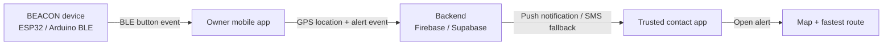

# BEACON App Blueprint

Generated: 2026-05-31

## Product Idea

BEACON is a wearable or handheld safety button connected to a mobile app. When the user presses the BEACON button, trusted contacts receive an urgent alert with the user's live or last-known location. The recipient can open a map, see where the alert happened, and get the fastest route to reach the user.

The core promise:

> "Press one button. Your trusted people instantly know where you are and how to get to you."

## Recommended MVP Architecture

The fastest version should use Bluetooth Low Energy between the BEACON device and the owner's phone. The phone handles GPS, internet, contacts, notifications, and maps.



Why this is the right first build:

- BLE is low-power and reliable for a wearable button near a phone.
- The phone already has GPS, data, permissions, contacts, push notification support, and battery.
- The BEACON hardware can stay small and cheaper.
- You can build and test the whole product before adding expensive standalone LTE/GPS hardware.

## Bluetooth vs Wi-Fi vs Standalone

### Option A: BLE + Phone, Recommended First

The BEACON button pairs with the owner's phone. When clicked, it sends a BLE event to the app. The app grabs the phone's current location and sends alerts.

Best for:

- MVP
- Lower battery use
- Small device
- Faster development

Limitation:

- The user's phone must be nearby and powered on.

### Option B: Wi-Fi BEACON

The device connects directly to Wi-Fi and sends alerts without the phone.

Best for:

- Home, school, office, dorm, or fixed-location use

Limitations:

- Wi-Fi setup is annoying on small devices.
- Does not work well while traveling.
- Location is weaker unless the device has GPS or relies on known Wi-Fi networks.

### Option C: Standalone GPS + LTE BEACON

The BEACON device includes GPS and cellular data. It can send alerts without a phone.

Best for:

- Premium BEACON Pro version
- Runners, kids, elderly users, field workers, outdoor use

Limitations:

- More expensive hardware
- Monthly SIM/data cost
- Bigger battery
- More certification and reliability work

## Mobile App Stack

Recommended starter stack:

- Mobile app: React Native with Expo development builds
- BLE: `react-native-ble-plx`
- Location: `expo-location`
- Maps: `react-native-maps`, Expo Maps, Google Maps, Apple Maps, or Mapbox depending on final routing needs
- Backend: Firebase for MVP
- Notifications: Firebase Cloud Messaging / APNs / FCM
- SMS fallback: Twilio later, only with clear consent

Important Expo note:

BLE and some background location features need a custom development build, not plain Expo Go, because BLE uses native code.

## Core User Flows

### 1. Owner Setup

1. Create account.
2. Pair BEACON device.
3. Name the device, for example "Ketav's BEACON."
4. Add emergency contacts.
5. Choose alert behavior:
   - Single click: check-in alert
   - Hold 2 seconds: emergency alert
   - Double click: silent emergency alert
6. Send a test alert.

### 2. Button Press

1. BEACON button is clicked.
2. Device sends BLE event to the owner's phone.
3. App gets current GPS location.
4. App creates an alert event in the backend.
5. Backend notifies selected trusted contacts.
6. Contacts open a map showing the alert location.

### 3. Trusted Contact Experience

1. Receive push notification: "Ketav triggered BEACON."
2. Open alert screen.
3. See:
   - Exact location pin
   - Time of alert
   - Battery/device status if available
   - User's optional message
   - "Navigate" button
   - "Call" button
   - "I am responding" button
4. Tap "Navigate" to open the fastest route in-app or in Apple/Google Maps.

## Key Screens

1. Home
   - Device connected/disconnected
   - Battery
   - Test alert button
   - Last alert status

2. Contacts
   - Add people
   - Set priority order
   - Choose who gets which alert type
   - Require contact acceptance

3. Device
   - Pair/unpair BEACON
   - Rename device
   - Configure press actions
   - Firmware version
   - Battery health

4. Alert Map
   - Location pin
   - Route ETA
   - Distance
   - Call/respond controls
   - Live updates if enabled

5. History
   - Past alerts
   - Test alerts
   - Cancelled alerts

6. Privacy & Safety
   - Who can see my location
   - How long alerts stay visible
   - Cancel countdown
   - Test mode

## Alert Event Data Model

```json
{
  "id": "alert_123",
  "ownerUserId": "user_abc",
  "deviceId": "beacon_001",
  "type": "emergency",
  "status": "active",
  "createdAt": "2026-05-31T16:00:00Z",
  "location": {
    "lat": 40.7128,
    "lng": -74.006,
    "accuracyMeters": 12
  },
  "recipients": [
    {
      "userId": "contact_1",
      "status": "notified"
    }
  ],
  "batteryPercent": 84,
  "pressPattern": "hold_2s"
}
```

## Suggested BLE Design

BEACON should act as the BLE peripheral. The phone app acts as the central device.

Custom BLE service:

- Service: `BEACON_ALERT_SERVICE`
- Characteristic: `button_event`
  - Notify
  - Sends press event payload
- Characteristic: `device_config`
  - Read/write
  - Lets app configure click actions
- Characteristic: `device_status`
  - Read/notify
  - Sends battery, firmware, connection health

Button event payload should include:

- Event ID
- Press type
- Battery level
- Timestamp or monotonic counter
- Signed nonce later for security

## Safety Features That Matter

These are not polish. They are part of the product.

- Test mode, so users can practice without alarming people.
- Cancel countdown, for example 5 seconds after accidental press.
- Silent mode, for dangerous situations where the device should not beep.
- Contact acceptance, so nobody is secretly added as a responder.
- Location expiration, for example alert links expire after 24 hours.
- Clear "last updated" timestamp on the map.
- Offline fallback: queue alert until network returns.
- Low battery warnings.
- False alert workflow: "I'm safe" message to all contacts.
- Abuse prevention and rate limiting.

## Build Phases

### Phase 1: Clickable App Prototype

Build the mobile UI with fake data:

- Home screen
- Add contacts
- Simulated BEACON click
- Alert notification mock
- Map screen with fake pin and navigation button

Goal:

Show the product experience before hardware is ready.

### Phase 2: Arduino / ESP32 BLE Proof of Concept

Build firmware where a button press sends a BLE notification to the phone.

Goal:

Phone receives a real hardware event.

### Phase 3: Real Location + Backend Alert

When BLE event arrives:

- Request location
- Create alert in backend
- Notify trusted contacts

Goal:

End-to-end alert from device click to contact notification.

### Phase 4: Routing + Responder Experience

Add:

- Alert map
- ETA
- "Open fastest route"
- Responding status

Goal:

The friend does not just know where you are. They know how to get there fast.

### Phase 5: Hardware Polish

Add:

- Battery reporting
- Charging
- Enclosure
- Better button
- LED/haptic feedback
- Firmware update path

Goal:

Turn prototype into a product people can carry.

## Biggest Technical Risks

1. iOS and Android background behavior
   - Phones may restrict BLE, location, or background tasks.
   - Test on real devices early.

2. App not running
   - If the companion app is killed, button alerts may fail.
   - This is why a standalone LTE model can become the premium version later.

3. Location permission
   - Users must understand why the app needs location.
   - Ask for permissions at the moment they make sense, not immediately on app launch.

4. Notification reliability
   - Push is good but not perfect.
   - Critical alerts may need SMS/call fallback.

5. Trust and privacy
   - The app handles sensitive location data.
   - Permission design, encryption, and expiration are central to the product.

## Recommended First Build

Build a mobile prototype first, then connect the Arduino/ESP32.

The first working demo should do this:

1. Open app.
2. Add two trusted contacts.
3. Pair a fake or real BEACON.
4. Press a simulated BEACON button.
5. Show an alert map.
6. Show the recipient view with a "Navigate" button.

After that, replace the simulated button with the actual BLE event from Arduino.

## References

- Expo development builds: https://docs.expo.dev/develop/development-builds/introduction/
- Expo Location: https://docs.expo.dev/versions/latest/sdk/location/
- Firebase Cloud Messaging: https://firebase.google.com/docs/cloud-messaging
- Google Routes API: https://developers.google.com/maps/documentation/routes/compute_route_directions
- Arduino Bluetooth Low Energy docs: https://docs.arduino.cc/learn/communication/bluetooth/
- react-native-ble-plx docs: https://dotintent.github.io/react-native-ble-plx/
- react-native-maps installation docs: https://github.com/react-native-maps/react-native-maps/blob/master/docs/installation.md
